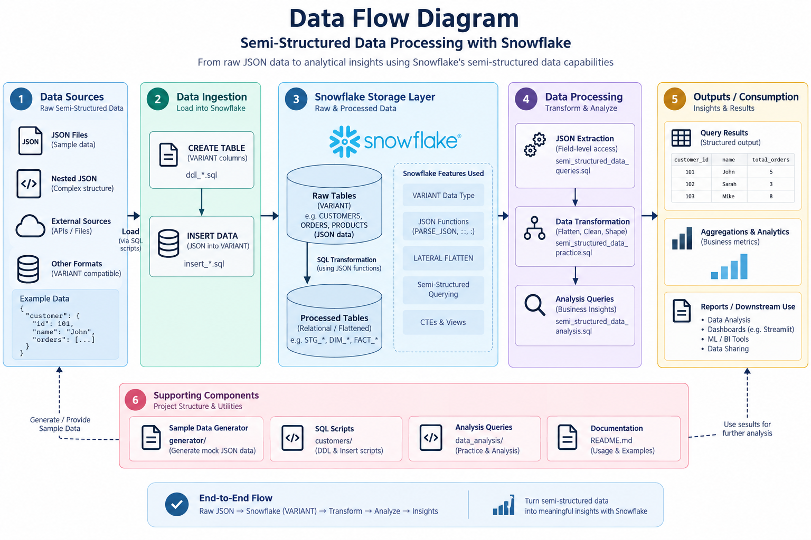
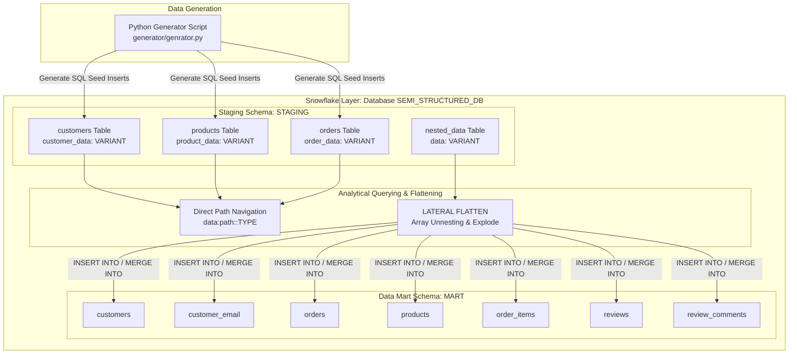
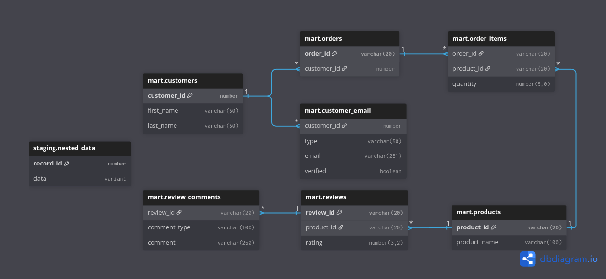
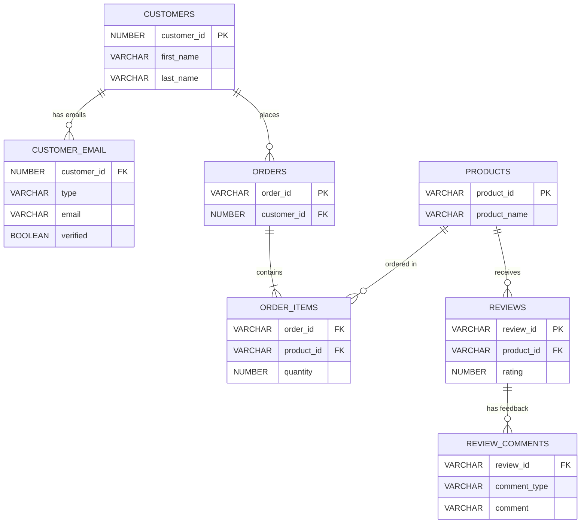

# Snowflake Semi-Structured Data Engineering

A comprehensive, production-grade Snowflake reference project demonstrating semi-structured data engineering techniques using `VARIANT`, `PARSE_JSON()`, nested JSON objects, arrays, path navigation, `LATERAL FLATTEN`, relational normalization, and idempotent streaming pipeline patterns (`MERGE INTO`).

---

## Table of Contents
- [Architecture & Data Flow](#architecture--data-flow)
- [Project Directory Structure](#project-directory-structure)
- [Staging Data Models & JSON Schemas](#staging-data-models--json-schemas)
  - [1. Customers Schema (`customers`)](#1-customers-schema-customers)
  - [2. Products Schema (`products`)](#2-products-schema-products)
  - [3. Orders Schema (`orders`)](#3-orders-schema-orders)
  - [4. Deeply Nested JSON Schema (`nested_data`)](#4-deeply-nested-json-schema-nested_data)
- [Snowflake Semi-Structured Querying Deep-Dive](#snowflake-semi-structured-querying-deep-dive)
  - [Path Navigation & Type Casting](#path-navigation--type-casting)
  - [Array Indexing vs. Dynamic Flattening](#array-indexing-vs-dynamic-flattening)
  - [Flattening Multi-Level Nested Arrays](#flattening-multi-level-nested-arrays)
- [Relational Normalization & Data Mart (ERD)](#relational-normalization--data-mart-erd)
  - [Normalized Relational Schema (ERD)](#normalized-relational-schema-erd)
  - [Normalization Pipeline SQL](#normalization-pipeline-sql)
- [Idempotent Pipelines & Incremental Processing](#idempotent-pipelines--incremental-processing)
- [Environment Setup & Execution Guide](#environment-setup--execution-guide)

---

## Architecture & Data Flow

This project demonstrates the complete lifecycle of semi-structured data engineering in Snowflake: from ingesting raw, un-schematized JSON payloads into `VARIANT` columns, querying nested attributes on-the-fly, dynamically unnesting arrays using `LATERAL FLATTEN`, to loading structured data into a relational Data Mart (`MART` schema) using idempotent `MERGE INTO` operations.

### High-Level Data Architecture Diagram



#### Interactive Architecture Diagram



### Linearized Data Lineage Flow

```
+--------------------------+
| Python Synthetic Generator|  (Generates random customers, products, orders & nested payloads)
+--------------------------+
             |
             v
+--------------------------+
| Snowflake STAGING Tables |  (Stores JSON strings via PARSE_JSON() into VARIANT columns)
+--------------------------+
             |
             +---------------------------------------+
             |                                       |
             v                                       v
+--------------------------+           +---------------------------+
| Direct JSON Path Querying|           | Multi-Level LATERAL       |
| (Colon Notation & Casting|           | FLATTEN Array Unnesting   |
+--------------------------+           +---------------------------+
                                                     |
                                                     v
                                       +---------------------------+
                                       | Relational Mart Ingestion |
                                       | (INSERT / MERGE INTO)     |
                                       +---------------------------+
                                                     |
                                                     v
                                       +---------------------------+
                                       | Normalized 3NF Schema     |
                                       | (SEMI_STRUCTURED_DB.MART) |
                                       +---------------------------+
```

---

## Project Directory Structure

```
.
├── init_databse.sql                 # Creates SEMI_STRUCTURED_DB database and STAGING / ANALYTICS schemas
├── setup_command.sh                 # Automates full Snowflake deployment via Snowflake CLI (snow sql)
├── data_overview.sql                # Verification queries inspecting top rows from staging tables
├── generator/
│   └── genrator.py                  # Python script producing realistic, multi-nested JSON datasets
├── customers/
│   ├── ddl_customer.sql             # Table definition for staging customers
│   └── insert_customers.sql         # Seed data insertion script (30 records with JSON payloads)
├── products/
│   ├── ddl_products.sql             # Table definition for staging products
│   └── insert_products.sql         # Seed data insertion script (32 records with JSON payloads)
├── orders/
│   ├── ddl_orders.sql               # Table definition for staging orders
│   └── insert_orders.sql            # Seed data insertion script (57 records with JSON payloads)
├── data_analysis/
│   ├── semi_structured_data_analysis.sql # Analytical SQL querying customers/orders using path navigation & FLATTEN
│   ├── semi_structured_data_queries.sql  # Direct array index path navigation demonstrations
│   └── semi_structured_data_practice.sql # Lateral flatten unnesting scripts across multi-nested levels
└── normalized_highly_nested_json/
    ├── highly_nested_data.sql       # DDL and sample data for deeply nested JSON (customer->orders->items->reviews)
    ├── normalized_ddl.sql           # Data Mart schema definition (MART schema 3NF relational tables)
    ├── insert_into.sql              # Relational insertion script normalizing nested VARIANT into MART tables
    └── idempotent_insert.sql        # Stream/Change-Data-Capture idempotent load using MERGE INTO pattern
```

---

## Staging Data Models & JSON Schemas

The staging schema (`SEMI_STRUCTURED_DB.STAGING`) holds semi-structured JSON documents inside Snowflake `VARIANT` columns. Below are the key schema structures stored in these tables.

### 1. Customers Schema (`customers`)

```json
{
  "profile": {
    "first_name": "Abigail",
    "last_name": "O'Brien",
    "email": "abigail.obrien@gmail.com",
    "loyalty_tier": "platinum",
    "join_date": "2022-04-15",
    "is_active": true,
    "account_balance": 340.50,
    "lifetime_value": 4520.00,
    "phone": "+1-555-0192",
    "birth_date": "1988-11-23",
    "gender": "female"
  },
  "address": {
    "street": "742 Evergreen Terrace",
    "city": "Springfield",
    "state": "OR",
    "zip": "97477",
    "country": "USA",
    "type": "shipping",
    "coordinates": { "lat": 44.0462, "lng": -123.0220 }
  },
  "preferences": {
    "newsletter_opt_in": true,
    "preferred_language": "en",
    "preferred_currency": "USD",
    "marketing_channels": ["email", "push"],
    "notification_settings": { "email": true, "sms": false, "push": true }
  },
  "devices": [
    {
      "device_id": "DEV-948201",
      "device_type": "mobile",
      "os": "iOS",
      "last_login": "2026-08-12T14:30:00Z",
      "is_trusted": true
    }
  ]
}
```

### 2. Products Schema (`products`)

```json
{
  "specifications": {
    "category": "Electronics",
    "subcategory": "Computing Accessories",
    "brand": "TechNova",
    "color_options": ["Black", "Silver"],
    "weight_kg": 1.25,
    "dimensions": { "length": 35.0, "width": 24.5, "height": 1.8, "unit": "cm" },
    "material": "Aluminum"
  },
  "pricing": {
    "base_price": 299.99,
    "currency": "USD",
    "tax_rate": 0.0825,
    "discount_percentage": 10,
    "cost_price": 180.00,
    "price_history": [
      { "date": "2025-01-10", "price": 329.99 },
      { "date": "2025-06-01", "price": 299.99 }
    ]
  },
  "suppliers": [
    {
      "supplier_id": "SUP-001",
      "supplier_name": "Pacific Rim Manufacturing",
      "country": "China",
      "lead_time_days": 14,
      "is_primary": true
    }
  ],
  "reviews": [
    {
      "review_id": "REV-PROD-0001-01",
      "customer_id": 1001,
      "rating": 5,
      "comment": "Exceeded my expectations, would buy again.",
      "review_date": "2026-02-14",
      "verified_purchase": true
    }
  ]
}
```

### 3. Orders Schema (`orders`)

```json
{
  "order_details": {
    "order_date": "2026-01-15T09:15:00Z",
    "order_status": "delivered",
    "order_channel": "web",
    "currency": "USD",
    "notes": "Please leave package at front door."
  },
  "items": [
    {
      "product_id": "PROD-0001",
      "product_name": "TechNova Wireless Bluetooth Headphones",
      "quantity": 1,
      "unit_price": 299.99,
      "line_total": 299.99,
      "options": { "color": "Black", "size": null }
    }
  ],
  "payment": {
    "method": "credit_card",
    "transaction_id": "TXN-849201849",
    "amount_paid": 315.24,
    "payment_status": "paid",
    "card_last4": "4821",
    "billing_address": { "street": "742 Evergreen Terrace", "city": "Springfield", "state": "OR", "zip": "97477", "country": "USA" }
  },
  "shipping": {
    "method": "standard",
    "carrier": "UPS",
    "tracking_number": "1Z9999999999999999",
    "estimated_delivery": "2026-01-20",
    "shipping_address": { "street": "742 Evergreen Terrace", "city": "Springfield", "state": "OR", "zip": "97477", "country": "USA" },
    "cost": 7.99
  },
  "discounts": [
    { "code": "SAVE10NOW", "type": "percentage", "value": 10, "applied_amount": 30.00 }
  ]
}
```

### 4. Deeply Nested JSON Schema (`nested_data`)

```json
{
  "customer": {
    "profile": {
      "personal": {
        "name": { "first": "Abigail", "last": "O'Brien" },
        "contact": {
          "emails": [
            {
              "type": "personal",
              "addresses": [
                { "email": "abigail@gmail.com", "verified": true },
                { "email": "abigail.work@gmail.com", "verified": true }
              ]
            }
          ]
        }
      }
    },
    "orders": [
      {
        "order_id": "ORD-1001",
        "items": [
          {
            "product": { "product_id": "P-101", "name": "Laptop" },
            "quantity": 1,
            "reviews": [
              {
                "review_id": "R-1",
                "rating": 5,
                "comments": [
                  { "type": "positive", "text": "Excellent laptop" },
                  { "type": "delivery", "text": "Fast delivery" }
                ]
              }
            ]
          }
        ]
      }
    ]
  }
}
```

---

## Snowflake Semi-Structured Querying Deep-Dive

Snowflake provides native support for `VARIANT` data types. Extracting data efficiently requires understanding path navigation syntax, casting operations, and unnesting mechanisms.

### Path Navigation & Type Casting

In Snowflake:
- `:` (Colon) navigates through JSON object keys.
- `.` (Dot) or `[]` (Brackets) navigates nested sub-fields or array indices.
- `::` (Double Colon) explicitly casts the `VARIANT` scalar into a SQL data type (e.g., `::STRING`, `::NUMBER`, `::BOOLEAN`, `::TIMESTAMP_TZ`).

```sql
SELECT
    customer_id,
    customer_data:profile:first_name::STRING               AS first_name,
    customer_data:profile:last_name::STRING                AS last_name,
    customer_data:profile:lifetime_value::FLOAT            AS lifetime_value,
    customer_data:address:city::STRING                     AS city,
    customer_data:address:coordinates:lat::FLOAT           AS latitude,
    customer_data:preferences:newsletter_opt_in::BOOLEAN   AS newsletter_opt_in
FROM SEMI_STRUCTURED_DB.STAGING.customers;
```

### Array Indexing vs. Dynamic Flattening

#### 1. Array Indexing (Static Position Access)
Used when array elements are predictable at specific positions:

```sql
SELECT
    data:customer:profile:personal:name:first::STRING                               as first_name,
    data:customer:profile:personal:contact:emails[0]:addresses[0]:email::STRING     as primary_email,
    data:customer:orders[0]:order_id::STRING                                        as first_order_id,
    data:customer:orders[0]:items[0]:product:name::STRING                           as first_product
FROM SEMI_STRUCTURED_DB.STAGING.nested_data;
```

#### 2. Dynamic Flattening (`LATERAL FLATTEN`)
`FLATTEN` explodes JSON arrays into table rows. Combining `LATERAL` allows joining array elements back to parent record attributes.

```sql
SELECT
    c.customer_id,
    c.customer_name,
    d.value:device_id::STRING   AS device_id,
    d.value:device_type::STRING AS device_type,
    d.value:os::STRING          AS os,
    d.value:is_trusted::BOOLEAN AS is_trusted
FROM SEMI_STRUCTURED_DB.STAGING.customers AS c,
LATERAL FLATTEN(INPUT => c.customer_data:devices) AS d;
```

### Flattening Multi-Level Nested Arrays

To extract data buried under 4+ levels of nested arrays (`customer -> emails -> addresses -> orders -> items -> reviews -> comments`), chain multiple `LATERAL FLATTEN` constructs:

```sql
SELECT
    nd.data:customer:profile:personal:name:first::STRING AS first_name,
    nd.data:customer:profile:personal:name:last::STRING  AS last_name,
    a.value:email::STRING                                AS email,
    o.value:order_id::STRING                             AS order_id,
    i.value:product:product_id::STRING                  AS product_id,
    i.value:product:name::STRING                        AS product_name,
    i.value:quantity::NUMBER                             AS quantity,
    r.value:review_id::STRING                            AS review_id,
    r.value:rating::NUMBER                               AS rating,
    c.value:text::STRING                                 AS comment_text,
    c.value:type::STRING                                 AS comment_type
FROM SEMI_STRUCTURED_DB.STAGING.nested_data AS nd,
LATERAL FLATTEN(INPUT => nd.data:customer:profile:personal:contact:emails) AS e,
LATERAL FLATTEN(INPUT => e.value:addresses) AS a,
LATERAL FLATTEN(INPUT => nd.data:customer:orders) AS o,
LATERAL FLATTEN(INPUT => o.value:items) AS i,
LATERAL FLATTEN(INPUT => i.value:reviews) AS r,
LATERAL FLATTEN(INPUT => r.value:comments) AS c;
```

---

## Relational Normalization & Data Mart (ERD)

Converting semi-structured data into a relational Third Normal Form (3NF) model improves analytical query performance, reduces data redundancy, and enforces strict schema constraints.

### Normalized Relational Schema (ERD)



#### Interactive ERD Diagram



### Normalization Pipeline SQL

Below is the transformation logic extracting relational entities from `staging.nested_data` into `mart` relational tables:

```sql
-- 1. Insert Unique Customers
INSERT INTO mart.customers (first_name, last_name)
SELECT DISTINCT
    data:customer:profile:personal:name:first::STRING AS first_name,
    data:customer:profile:personal:name:last::STRING  AS last_name
FROM staging.nested_data;

-- 2. Insert Customer Emails
INSERT INTO mart.customer_email (customer_id, type, email, verified)
SELECT
    c.customer_id,
    e.value:type::STRING     AS email_type,
    a.value:email::STRING    AS email,
    a.value:verified::BOOLEAN AS verified
FROM staging.nested_data AS nd
INNER JOIN mart.customers AS c
    ON c.first_name = nd.data:customer:profile:personal:name:first::STRING
   AND c.last_name  = nd.data:customer:profile:personal:name:last::STRING
CROSS JOIN LATERAL FLATTEN(INPUT => nd.data:customer:profile:personal:contact:emails) AS e
CROSS JOIN LATERAL FLATTEN(INPUT => e.value:addresses) AS a;

-- 3. Insert Orders
INSERT INTO mart.orders (order_id, customer_id)
SELECT
    o.value:order_id::STRING AS order_id,
    c.customer_id
FROM staging.nested_data AS nd
INNER JOIN mart.customers AS c
    ON c.first_name = nd.data:customer:profile:personal:name:first::STRING
   AND c.last_name  = nd.data:customer:profile:personal:name:last::STRING
CROSS JOIN LATERAL FLATTEN(INPUT => nd.data:customer:orders) AS o;

-- 4. Insert Order Items
INSERT INTO mart.order_items (order_id, product_id, quantity)
SELECT
    oi.order_id,
    p.product_id,
    i.value:quantity::NUMBER AS quantity
FROM staging.nested_data AS nd
CROSS JOIN LATERAL FLATTEN(INPUT => nd.data:customer:orders) AS o
INNER JOIN mart.orders AS oi
    ON oi.order_id = o.value:order_id::STRING
CROSS JOIN LATERAL FLATTEN(INPUT => o.value:items) AS i
INNER JOIN mart.products AS p
    ON p.product_id = i.value:product:product_id::STRING;
```

---

## Idempotent Pipelines & Incremental Processing

In production streaming or CDC (Change Data Capture) architectures, inserting data repeatedly can result in duplicate records. Using `MERGE INTO` guarantees **idempotency** (ensuring identical processing results regardless of how many times the script is executed).

### Idempotent Merge SQL Pattern

```sql
MERGE INTO mart.customer_email AS target
USING (
    SELECT DISTINCT
        c.customer_id,
        e.value:type::STRING      AS email_type,
        a.value:email::STRING     AS email,
        a.value:verified::BOOLEAN  AS verified
    FROM staging_stream AS s
    INNER JOIN mart.customers AS c
        ON c.first_name = s.data:customer:profile:personal:name:first::STRING
       AND c.last_name  = s.data:customer:profile:personal:name:last::STRING
    CROSS JOIN LATERAL FLATTEN(INPUT => s.data:customer:profile:personal:contact:emails) AS e
    CROSS JOIN LATERAL FLATTEN(INPUT => e.value:addresses) AS a
) AS source
ON target.customer_id = source.customer_id
AND target.email = source.email

WHEN MATCHED THEN
    UPDATE SET
        target.email_type = source.email_type,
        target.verified   = source.verified

WHEN NOT MATCHED THEN
    INSERT (customer_id, email_type, email, verified)
    VALUES (source.customer_id, source.email_type, source.email, source.verified);
```

---

## Environment Setup & Execution Guide

### Prerequisites
1. **Snowflake Account** with permissions to create databases and schemas.
2. **Snowflake CLI (`snow`)** installed and configured (or execute scripts directly in Snowflake Worksheet).

### Automated Setup via Shell Script

The project provides an automated bash deployment script (`setup_command.sh`):

```bash
chmod +x setup_command.sh
./setup_command.sh
```

### Manual Execution Order

If executing manually via Snowflake Worksheet or SnowSQL, execute files in this sequence:

1. **Database & Schema Initialization**:
   ```sql
   !source init_databse.sql
   ```
2. **Create Staging Tables**:
   ```sql
   !source customers/ddl_customer.sql
   !source products/ddl_products.sql
   !source orders/ddl_orders.sql
   ```
3. **Seed Data Insertion**:
   ```sql
   !source customers/insert_customers.sql
   !source products/insert_products.sql
   !source orders/insert_orders.sql
   ```
4. **Deeply Nested JSON & Data Mart Normalization**:
   ```sql
   !source normalized_highly_nested_json/highly_nested_data.sql
   !source normalized_highly_nested_json/normalized_ddl.sql
   !source normalized_highly_nested_json/insert_into.sql
   ```
5. **Analytical Queries**:
   ```sql
   !source data_analysis/semi_structured_data_analysis.sql
   ```

---
*Maintained as part of Snowflake Data Engineering Reference Architecture.*
